<!-- hero: monochrome ASCII portrait (types in) beside a neofetch-style info
     panel. regenerate portrait: drop a background-stripped photo named
     source_photo.* in this folder, then run python scripts/make_ascii_svg.py
     (or python scripts/launch.py to regenerate everything at once);
     info panel: python scripts/make_info_card.py -->
<!-- animated contribution graph: real data, boxes reveal cell by cell
     (regenerated daily by .github/workflows/main.yml) -->
<h3><code>~ $ ./contributions.sh</code></h3>

 
 
<h3><code>~ $ whoami</code></h3>
<table>
<tr>
<td valign="top"></td>
<td valign="top"></td>
</tr>
</table>
 
 
<h3><code>~ $ mylinks</code></h3>

<b><YOUR_TITLE></b>

 

